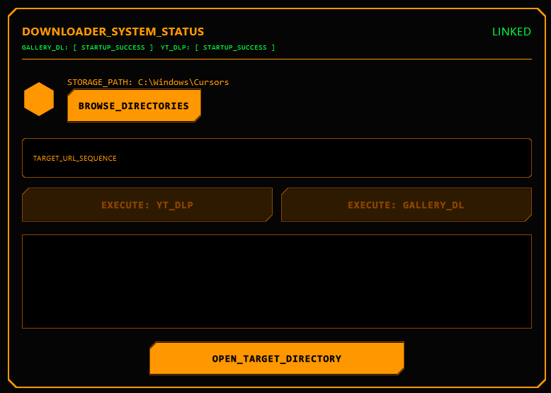

Provide a basic GUI for accessing CLI tools that I keep forgetting the commands for

This is currently set up to my specific windows usage.

Needless to say, this is a personal project and not intended for public use.

If you use this for yourself only download your own media that you are unable to do so in bulk otherwise.

Respect copyright and terms of service of media providers.

- [x] Checks the system clipboard for commands
- [x] Lets you select an output folder for them
- [ ] Should probably do some set up if you don't have the commands ready



Q: Why kotliln Multiplatform?
A: Because I wanted to learn kotlin more and I dont want to use electron

This is a Kotlin Multiplatform project targeting Desktop (JVM).

* [/composeApp](./composeApp/src) is for code that will be shared across your Compose Multiplatform applications.
  It contains several subfolders:
    - [commonMain](./composeApp/src/commonMain/kotlin) is for code that’s common for all targets.
    - Other folders are for Kotlin code that will be compiled for only the platform indicated in the folder name.
      For example, if you want to use Apple’s CoreCrypto for the iOS part of your Kotlin app,
      the [iosMain](./composeApp/src/iosMain/kotlin) folder would be the right place for such calls.
      Similarly, if you want to edit the Desktop (JVM) specific part, the [jvmMain](./composeApp/src/jvmMain/kotlin)
      folder is the appropriate location.

### Build and Run Desktop (JVM) Application

To build and run the development version of the desktop app, use the run configuration from the run widget
in your IDE’s toolbar or run it directly from the terminal:

- on macOS/Linux
  ```shell
  ./gradlew :composeApp:run
  ```
- on Windows
  ```shell
  .\gradlew.bat :composeApp:run
  ```

---

Learn more about [Kotlin Multiplatform](https://www.jetbrains.com/help/kotlin-multiplatform-dev/get-started.html)…